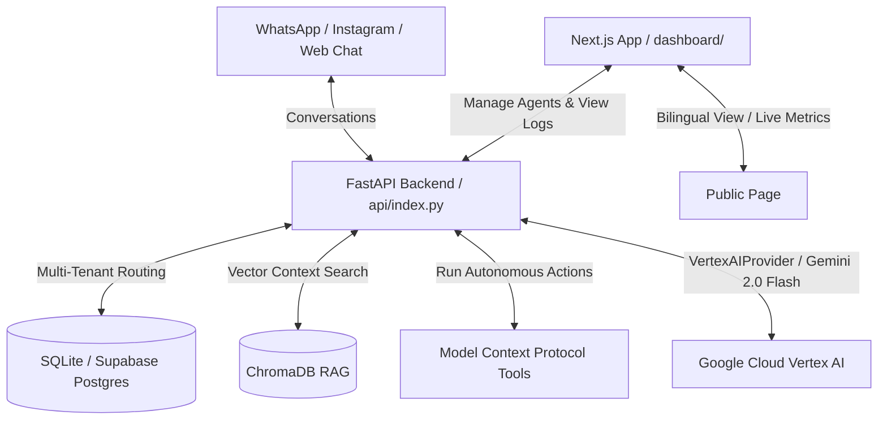

# PLATAFORMA GENIA

> AI-Native Agent-as-a-Service platform empowering small businesses in Latin America to automate customer service, qualify leads, and schedule appointments 24/7 with human-like conversation.

[](https://xprize.devpost.com/)
[](#bilingual-version)

---

## 🔗 Hackathon Resources

*   **Demo Video & AI Script Guide:** Managed in our [NotebookLM Notebook](https://notebooklm.google.com/notebook/89036179-baa9-4fbc-885e-b6b27cf333fe)
*   **Business Narrative:** Detailed in [NARRATIVE.md](./NARRATIVE.md) (Operations, Jobs, Coworking Barter Model)
*   **Financials & Unit Economics:** Outlined in [FINANCIALS.md](./FINANCIALS.md) (Barter valuation, operational costs, margins)
*   **Reusable Submission Guide:** Learn how to adapt other projects in [XPRIZE_SUBMISSION_GUIDE.md](./XPRIZE_SUBMISSION_GUIDE.md)

---

## 🌟 Hackathon Category: Small Business Services

GENIA is custom-tailored for the **"Small Business Services"** category. Small and medium enterprises (SMEs) in Latin America lose up to 50% of potential sales due to response delays. Hiring round-the-clock call centers is financially impossible for them. GENIA solves this by providing autonomous, conversational agents at a fraction of the cost, running on Google Cloud infrastructure.

---

## 🛠️ System Architecture

Our platform is built to be secure, multi-tenant, and AI-Native:



### AI-Native Flow:
1.  A customer messages a business (e.g. via WhatsApp).
2.  The **FastAPI Backend** intercepts the request and verifies the tenant's API Key and subscription limits.
3.  The **RAG Service** queries ChromaDB to fetch business-specific context (pricing, operating hours, catalog).
4.  The system formats a prompt and queries **Google Cloud Vertex AI (Gemini 2.0 Flash)**.
5.  If Gemini determines an action is needed (e.g. booking an appointment), it returns a tool call. The backend executes the corresponding **MCP Tool** (e.g. writing to the database or calendar API), logs the action in `action_logs`, and provides the result back to Gemini.
6.  Gemini generates the final response, which is sent back to the customer.

---

## 💻 Tech Stack

*   **Core AI Engine:** Google Cloud Vertex AI (Gemini 2.0 Flash)
*   **Backend API:** Python FastAPI + SQLAlchemy + Alembic (Database Migrations)
*   **Frontend Dashboard:** React + Next.js App Router (TypeScript)
*   **Vector Search & RAG:** ChromaDB (Vector DB)
*   **Deployment:** Vercel (Frontend & Serverless Backend functions)

---

## 🚀 Local Setup

### Backend
1.  Navigate to the backend directory:
    ```bash
    cd backend
    ```
2.  Create a virtual environment and activate it:
    ```bash
    python -m venv .venv
    # Windows
    .venv\Scripts\activate
    ```
3.  Install dependencies:
    ```bash
    pip install -r requirements.txt
    ```
4.  Configure your environment variables in `.env` (refer to `.env.example`):
    *   Set your Google Cloud credentials and Vertex AI details.
5.  Run database migrations:
    ```bash
    alembic upgrade head
    ```
6.  Start the FastAPI dev server:
    ```bash
    uvicorn main:app --reload
    ```

### Frontend Dashboard
1.  Navigate to the dashboard directory:
    ```bash
    cd dashboard
    ```
2.  Install dependencies:
    ```bash
    npm install
    ```
3.  Start the development server:
    ```bash
    npm run dev
    ```

---

## 🌐 Bilingual Version / Versión en Español

Para ver la documentación completa del proyecto, planes comerciales y detalles técnicos en español, por favor consulta [PROGRESS.md](./PROGRESS.md) y nuestra guía de preparación [XPRIZE_SUBMISSION_GUIDE.md](./XPRIZE_SUBMISSION_GUIDE.md).
La landing page pública del proyecto `/` cuenta con un selector de idioma dinámico **ES / EN** para facilitar la evaluación de los jueces.
